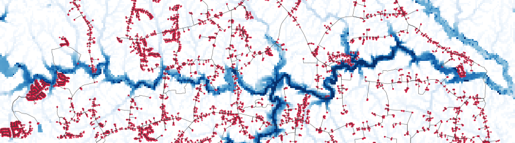

# Flood-Resilient Microgrids



**In-progress** Flood-RM prepares the following data pipeline:

### 1. Synthetic Distribution Feeder

**Option A: SMART-DS feeder**: Start from an existing synthetic SMART-DS regional dataset 

Supported regions include Austin, Greensboro, and San Francisco.

**example**
```bash
uv run python scripts/get_smartds.py sfo --execute
```

**Option B: New synthetic feeder**: Model a new location from geographic and building data.  Builds a radial distribution feeder using SHIFT/GDM/DiTTo, then augments it with additional data for microgrid operations. 

To create a feeder for a new location, copy/paste the Marshfield location as a new location, rename, and edit the main configuration file:

see `config.yaml` for an example of the structure.

`01_grid/02_augment_network/` adds additional components to the SHIFT network:

- critical-facility and critical-load annotations
- DER inventory and synthetic load profiles
- controllable sectionalizing switches
- switch-bounded load blocks
- ONM/RPOP-ready export artifacts

`01_grid/03_audit_network/` validates the synthetic-grid artifacts based on SMART-DS evaluation guidelines

### 2. Design-Event Boundary Conditions

The flood workflow builds staged stochastic scenario ensembles for coastal and inland locations:

Hydrodynamic models:
- **Inland coupled**: HydroMT-Wflow routes upstream rainfall-runoff to SFINCS discharge handoff points while SFINCS receives local direct rainfall 
- **Coastal, Wave-enabled**: quadtree SFINCS with SnapWave and infragravity-wave coupling 

**Primary Data Sources:** 
- coastal total water levels from CORA or NOAA CO-OPS sources
- wave data from ERA5
- rainfall from AORC stochastic storm transposition (SST)
- routed streamflow from USGS
- antecedent soil moisture from NWM retrospective products

**Current design-event defaults are:**
- 100,000 candidate driver combinations before tail filtering
- 500 tail-sampled design drivers in the stress/training catalogue with user defined importance sampling distribution

### 3. Handoff for Hydrodynamic Solver and Post-Run Evaluation

## Local Credentials
Suggested local paths: 
- EarthDataHub ERA5 via `EARTHDATAHUB_TOKEN` or `artifacts/credentials/earthdatahub-api-key.txt`
- CDS ERA5 via `~/.cdsapirc`
- REopt/NLR via `NLR_API_KEY` or `artifacts/credentials/nlr_api.txt`.